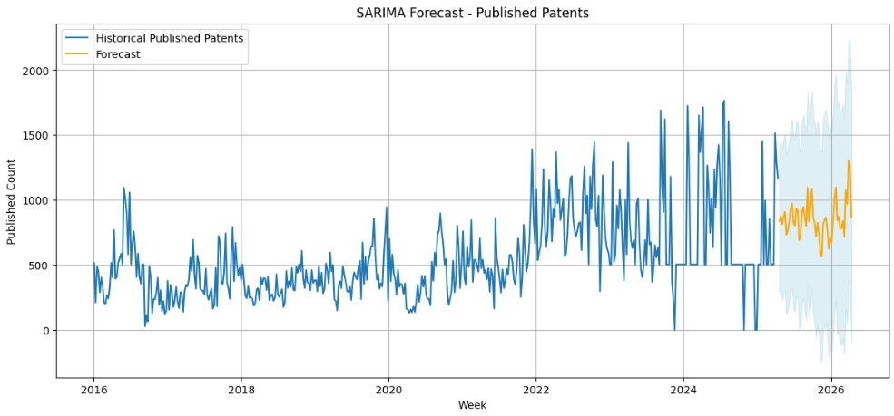
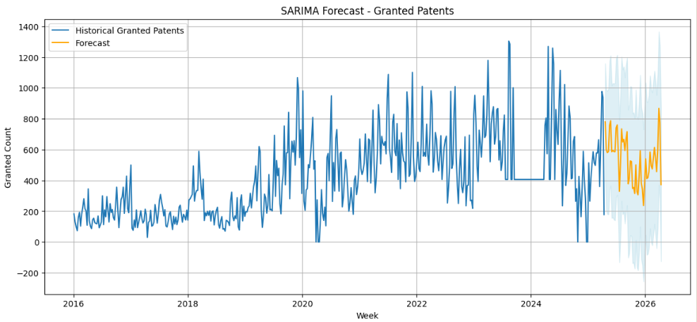

# Forecasting-Number-of-Patent-Applications-published-and-granted-based-on-historical-data-SARIMA-

This repository contains a time series forecasting project that analyzes weekly counts of published and granted patents using the SARIMA (Seasonal ARIMA) model. The analysis is based on real patent data and includes data preprocessing, visualization, stationarity checks, decomposition, forecasting, outlier treatment, and model evaluation.

## Dataset

The data was retrieved through an api from official government website (data.gov.in).  

Two CSV files are used:
patent_published.csv: Contains publication dates of patents.

patent_granted.csv: Contains dates when patents were granted.

Both files are assumed to have a PUBLICATION_DATE column.

## Key Steps

**1. Data Preparation**

Load datasets using pandas from Google Drive.
Convert PUBLICATION_DATE to datetime format.
Resample data weekly to calculate counts.

**2. Time Series Analysis**

Visualize trends for both published and granted patents.
Decompose time series using seasonal_decompose.
Perform stationarity checks with the ADF (Augmented Dickey-Fuller) test.
Identify seasonal patterns.

**3. Model Building**

Fit SARIMA models using statsmodels for both published and granted series.
Tune hyperparameters (p,d,q)(P,D,Q,s) based on ACF/PACF plots.
Forecast patent trends for the next 52 weeks.
Visualize forecast with confidence intervals.

**4. Outlier Detection**

Detect outliers using the IQR (Interquartile Range) method.
Replace detected outliers with the median.
Refit SARIMA models with cleaned data.

**5. Evaluation**

Evaluate forecasts using:
Mean Absolute Error (MAE)
Mean Squared Error (MSE)

# SARIMA Forecast - Patents Published

# SARIMA Forecast - Patents Granted

